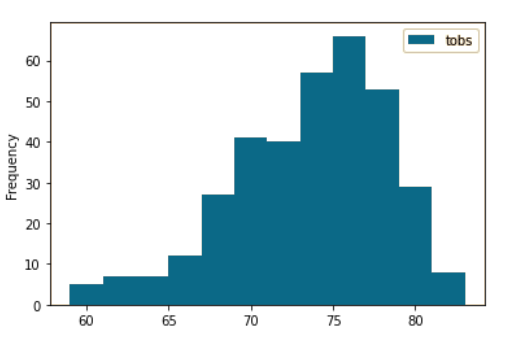

# [Surfs_Up](./climate_analysis.ipynb)

## Overview

This analysis is to demonstrate an understanding of SQLAlchemy and Flask using local "flat" files. 

## Purpose:
The purpose of this analysis is to idenify temperature trends for the months of June and December in Oahu in order to determine year-round sustainability of a beach surf and ice cream shop startup.

## Results:
Analysis of weather data reveals
- Average temperature for June is 74.94 F and average temperature for December is 71.04 F
- Maximum temperature for June is 85.00 F and maximum temperature for December is 83.00 F
- Minimum temperature for June is 64.00 F and minimum temperature for December is 56.00 F

## Summary:

When considering the year-round viability of an ice cream surf shop in Oahu it is quite clear that the differences between June and Decemember temperatures are so small that one would absolutely proceed with funding the project. However there are some more things to consider than just temperature, for instance precipitation.
Pulling from the same weather data we can see that the average precipitaion between 2010 and 2016 is 0.136360 inches for June and 0.216819 inches for December which is not enough to ruin anyone's beach day or appetite for ice cream. Surf's Up

